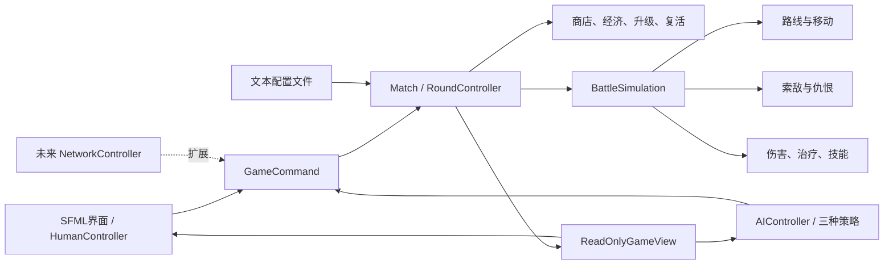
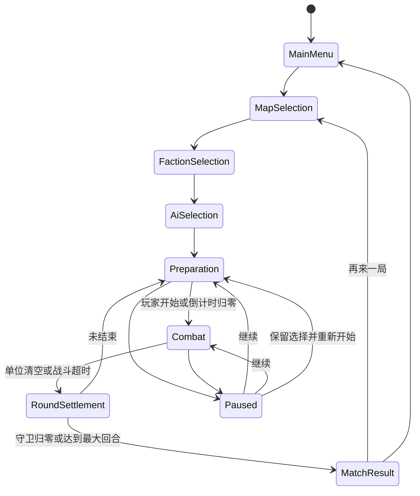

# C++ / SFML 自走棋对战系统开发计划

## 1. 项目目标与验收范围

开发一个 Windows 平台的单机自走棋小游戏，使用 C++17、Visual Studio Code、CMake、Ninja、MSVC x64 工具链和 SFML 2.6.x。玩家通过鼠标完成地图、分队、AI策略选择，以及购买、部署、升级、出售、复活和技能释放，随后与电脑自动战斗。

最终交付：

- 可由 Visual Studio Code 打开、配置、编译和调试的完整 CMake 工程及源代码。
- 可运行的 Release x64 程序及所需 SFML DLL。
- 课程设计报告、运行截图、演示视频。
- 两张地图、三个分队、五种单位及各自技能。
- 三种可适配任意地图和分队的 AI。
- 独立测试程序、测试数据文件和测试结果日志。
- 从主菜单开始，能够稳定完成一局默认 3 回合的游戏。

课程硬性要求以任务书为准：:codex-file-citation{path="D:/1/2026程设2大作业任务书-自走棋对战系统.docx" purpose="source"}

## 2. 最终需求确认

### 2.1 对局流程

1. 主菜单选择开始游戏。
2. 选择地图。
3. 玩家选择自己的分队。
4. 玩家选择 AI 策略；AI根据策略选择其分队，测试程序可强制指定 AI 分队。
5. 进入准备阶段：
   - 获得回合基础金币及上一回合败者补助。
   - 商店随机生成 6 个一级单位，不保留上回合商品。
   - 玩家购买、刷新、部署、重新部署、合成、出售或复活单位。
   - AI立即完成对应操作。
   - 玩家可提前开始；倒计时归零后自动开始。
6. 战斗阶段自动移动和攻击，玩家只能选择己方单位并释放技能。
7. 战场单位全部死亡或到达敌方守卫点后进行结算；超时则剩余单位视为存活。
8. 任一守卫值归零或达到最大回合数后结束游戏，否则进入下一回合。

### 2.2 胜负和跨回合规则

- 最大回合数从配置文件读取，初始值为 3。
- 每个单位具有独立的“扣除守卫值”属性，到达敌方守卫格后造成相应伤害并从战场消失。
- 同一模拟帧内的守卫伤害批量结算；双方同时归零则平局。
- 回合败者为本回合承受守卫伤害更多的一方；相同则本回合平局，双方均无败者补助。
- 最大回合结束后比较守卫值：高者获胜，相同则平局。
- 战斗存活、到达守卫点或超时存活的单位恢复满血，并在下一准备阶段进入备用区。
- 战斗死亡单位进入待复活列表，不占用活动单位容量。
- 死亡单位可在以后任一准备阶段手动复活，保留等级、恢复满血，并进入备用区。
- 复活费为该单位经当前分队修正后的一级购买价的 50%，四舍五入。
- 备用区容量改为配置项，并同时作为“非死亡单位总持有上限”；已部署单位也计入该上限，确保战后所有存活单位均能返回备用区。
- 分队部署上限不得超过总持有上限。

### 2.3 商店、升级和出售

- 商店单位池无限，每次显示 6 个一级单位。
- 刷新费用、初始金币、回合收入和败者补助均从配置文件读取。
- 单位价格固定，但可以被分队效果修正。
- 购买成功后进入第一个空闲备用区位置；容量或金币不足时阻止操作并显示中文提示。
- 准备阶段允许在备用区和部署区之间拖拽、重新部署和出售。
- 两个类型、等级完全相同的单位拖到同一位置时合成。
- 最高等级为 3：两个一级合成二级，两个二级合成三级。
- 合成消耗两个原单位，生成一个高一级单位，并返还经分队修正后的一级购买价的 40%，四舍五入。
- 任意等级单位出售时，都只返还该单位经分队修正后的一级购买价的 75%，四舍五入。
- 金币只使用整数；统一使用 `std::round` 后转换为整数。

### 2.4 地图和移动

最终规则覆盖早期讨论中的旧规则：

- MVP 为两张地图，不是五张。
- 部署时一个格子最多一个单位。
- 战斗位置为连续二维坐标，单位沿格子中心组成的路线连续移动。
- 路线只能连接上下左右相邻格，不允许斜向路线。
- 每张地图为双方每个合法部署格分别配置一条完整路线。
- 战斗开始时按部署格取得路线，此后不重新寻路。
- 偏离路线时，寻找尚未经过且距离当前位置最近的路径点，返回后继续前进，不回退到已完成路径段。
- 单位之间不碰撞、互不阻挡；只检测地形和地图边界。
- 地图文件必须保证每个合法部署格都有一条通向敌方守卫点的有效路线。
- 攻击范围按连续坐标的欧氏距离计算，单位为“格”。

### 2.5 战斗、索敌和技能

- 普通攻击间隔：

  `攻击间隔（秒） = 200 / (100 + 攻击速度)`

- 攻击速度限制在 `0～600`。
- 物理伤害：`max(攻击力 - 物理防御, 5)`。
- 法术伤害：`法术伤害 × (100 - 法术抗性) / 100`。
- 法术抗性限制在 `0～100`。
- 普通攻击和技能分别携带伤害类型，同一单位的普通攻击和技能可以使用不同类型。
- 普通战斗单位发现目标后停止移动；不能边移动边攻击。
- 目标死亡后继续沿原路线移动。
- 目标离开攻击范围后立即清除仇恨，不追击，继续沿原路线移动。
- 每个攻击者记录敌人首次进入其范围的模拟帧；优先攻击进入最早者，同帧进入时选择单位编号较小者。
- 医疗单位可以治疗自己，优先治疗范围内生命值比例最低的友军；满血单位无效；同生命比例按单位编号选择；治疗不超过最大生命值；没有目标时继续移动。
- 技力回复速度固定为每秒 1 点；初始值和最大值由单位配置决定。
- 技力达到最大值后保持不变；释放技能时全部消耗。
- 技能生效期间技力不回复；技能结束后从 0 重新积攒。
- 技能没有额外冷却时间。
- 玩家点击己方单位，再点击技能按钮；技能自行选择目标，不需要再次点击目标或地图。
- 技能只支持单体/多体伤害、单体治疗和限时属性增益。
- 技能期间的移动、攻击和施法行为由该技能的描述决定。
- 暂停时不能释放技能，模拟时间、准备倒计时和战斗倒计时均停止。

## 3. MVP 与扩展功能

### MVP

- C++17 + SFML 2.6.x 图形窗口。
- 中文主菜单、帮助、地图/分队/AI选择、暂停、重新开始和结果界面。
- 两张地图及预定义路线。
- 三个分队。
- 五个具体单位和五个可手动释放的技能。
- 商店、刷新、备用区、拖拽部署、升级、出售、复活。
- 连续移动、索敌、普通攻击、治疗、技力和技能。
- 三种 AI：进攻型、防守型、路线型。
- 可配置回合、经济、地图、分队、单位和技能。
- 独立测试程序、测试输入文件、测试日志。
- 完整课程报告、截图、演示视频和 Release 程序。

### 扩展功能

- 精细贴图、动作动画、粒子效果和音效。
- 更多单位、技能、分队和地图。
- 动态寻路、单位碰撞和局部避障。
- 双人联网；MVP 仅保留控制器替换接口。
- 保存与读取游戏。
- 更复杂的状态效果、位移和控制技能。

## 4. 总体架构

采用“纯 C++ 核心逻辑 + SFML 表现层”的分层结构，并建立三个 CMake 构建目标：

- `AutoChessCore`：静态库，不依赖 SFML，包含规则、数据、AI和战斗模拟。
- `AutoChessGame`：SFML 可执行程序，负责窗口、输入、界面和绘制。
- `AutoChessTests`：控制台测试程序，链接 `AutoChessCore`，使用 `assert` 和测试日志。

核心逻辑不直接读取鼠标，也不直接绘图；真人、AI和未来网络玩家都通过统一命令接口操作游戏。



### 主循环

- 单线程运行，不使用多线程。
- SFML持续处理窗口事件并绘制。
- 核心模拟使用固定步长 `1/60 秒`。
- 每帧限制最大累计时间，避免窗口卡顿后一次执行过多更新。
- 暂停时只处理界面和恢复命令，不调用核心模拟更新。
- 所有技能、购买和部署操作先转换为命令，在模拟更新边界执行。



## 5. 核心模块职责

- **配置模块**：读取、校验游戏、单位、技能、分队、地图和测试场景文件。
- **地图模块**：保存格子、障碍、部署区、守卫点和预定义路线；验证路线合法性。
- **玩家模块**：保存金币、守卫值、分队、活动单位、死亡单位、部署和上回合结果。
- **单位模块**：区分跨回合持有单位和仅存在于战斗中的单位实例。
- **经济模块**：商店、刷新、购买、出售、合成、复活和整数取整。
- **战斗模块**：固定步长模拟、移动、索敌、攻击、治疗、技能、死亡和守卫伤害。
- **技能模块**：技力、激活条件、持续时间、自动选目标和三类技能效果。
- **AI模块**：通过只读视图分析当前合法信息，并发出与真人相同的命令。
- **应用状态模块**：控制菜单、选择、准备、战斗、暂停、结算和结果。
- **SFML表现层**：窗口、鼠标键盘、拖拽、按钮、文字、色块单位和状态条。
- **测试模块**：读取测试场景、执行核心逻辑、断言并写入日志。

## 6. 主要类和数据结构

### 6.1 课程要求对应

- `Screen`、`Unit`、`Skill`、`IPlayerController`、`IAiStrategy` 均为抽象类或接口。
- 五个具体单位通过继承和虚函数实现自己的技能。
- `ActiveSkillUnit : public Unit, public ISkillUser` 作为明确的多重继承派生类；`ISkillUser` 只包含纯虚接口，避免复杂菱形继承。
- `UnitIdentity::operator==` 比较单位类型和等级，用于合成判定。
- `operator<<` 输出测试结果和关键对象摘要。
- 使用 STL 容器、智能指针和文件流；不为展示知识点额外引入复杂模板框架。

### 6.2 核心类型

- `GameConfig`：回合、倒计时、经济比例、商店数量、持有上限等。
- `MapDefinition`：尺寸、地形、部署区、守卫格和双方路线表。
- `FactionDefinition`：初始守卫值、部署上限、价格修正和单位属性修正。
- `UnitDefinition`：基础属性、三个等级参数、价格、普通行动策略和技能ID。
- `OwnedUnit`：持久ID、单位类型、等级、所属玩家、当前状态。
- `BattleUnit`：对应 `OwnedUnitId`、实时位置、生命值、技力、目标、路线进度、计时器和技能状态。
- `PlayerState`：金币、守卫值、分队、活动单位、死亡单位和部署映射。
- `ShopOffer`：单位类型、显示价格和商品槽位。
- `Route`：有序格子中心列表。
- `GameCommand`：购买、刷新、移动、合成、出售、复活、开始战斗、释放技能、暂停和重新开始。
- `CommandResult`：成功标志、错误类型和中文提示。
- `ReadOnlyGameView`：提供给界面和AI的只读快照，不暴露可修改内部对象。

### 6.3 关键接口

- `IPlayerController`：读取只读视图并生成命令；实现 `HumanController` 和 `AIController`。
- `IAiStrategy`：实现准备阶段购买/部署决策和战斗技能决策。
- `Match`：验证并执行命令，推动回合状态，生成只读视图。
- `BattleSimulation`：按固定时间步更新，输出死亡、守卫伤害和存活结果。
- `TargetSelector`：根据敌我、进入时间、生命比例和编号选择目标。
- `Skill`：检查释放条件、生成效果并更新持续状态。
- `UnitFactory`：根据单位定义和等级创建具体战斗单位。
- `ConfigLoader`：将文本文件解析为定义对象并返回带路径和行号的错误。

对象之间只通过ID建立长期引用，避免保存指向 `vector` 元素的裸指针。

## 7. 配置文件和数据格式

采用简单分段键值文本，不引入 JSON 库。

```text
data/
  game.cfg
  units.cfg
  skills.cfg
  factions.cfg
  maps/
    map_01.map
    map_02.map
  tests/
    damage_cases.txt
    economy_cases.txt
    battle_cases.txt
```

### `game.cfg`

包含：

- `max_rounds`
- `preparation_seconds`
- `combat_timeout_seconds`
- `starting_gold`
- `round_income`
- `loser_bonus`
- `shop_slots=6`
- `shop_refresh_cost`
- `roster_capacity`
- `sell_ratio=0.75`
- `merge_refund_ratio=0.40`
- `revive_ratio=0.50`
- `max_unit_level=3`
- 测试随机种子

### `units.cfg`

每个单位包含名称、职业标签、生命、攻击、物防、法抗、攻击距离、移动速度、攻击速度、守卫伤害、价格、初始/最大技力、普通行动策略、技能ID和三个等级的数值倍率。

### `factions.cfg`

每个分队包含名称、初始守卫值、最大部署数、价格倍率及针对指定单位/属性的加法或乘法修正。分队修正每次从基础定义重新计算，不跨回合累积。

### 地图文件

包含：

- 地图名称、宽度、高度。
- 字符网格：可通行、障碍、双方部署区、双方守卫格。
- 每个合法部署格对应的路线。
- 路线验证：起点匹配部署格、终点匹配敌方守卫、坐标合法、全部可通行、相邻点只能上下左右移动。

无效配置不允许进入游戏；显示中文错误、文件路径和行号，测试程序返回非零状态。

## 8. 建议目录与文件划分

```text
AutoChess/
  CMakeLists.txt
  CMakePresets.json
  .vscode/
    settings.json
    launch.json
  build/
  third_party/
    SFML/
  src/
    core/
      config/
      model/
      map/
      economy/
      combat/
      skills/
      ai/
      match/
    game/
      main.cpp
      screens/
      ui/
      rendering/
  tests/
    TestMain.cpp
    config/
    economy/
    combat/
    ai/
  data/
    game.cfg
    units.cfg
    skills.cfg
    factions.cfg
    maps/
    tests/
  docs/
    report/
    screenshots/
    video/
  dist/
```

头文件和实现文件按模块成对放置；小型枚举和纯数据结构可以集中在模块的 `Types.hpp`，避免一个简单类型创建一个文件。

## 9. 十天开发阶段

### 第1天：工程与SFML最小闭环

- **目标**：建立三个 CMake 构建目标并成功显示窗口。
- **模块**：VS Code 工作区、CMake构建配置、SFML。
- **任务**：
  - 确认 VS Code 的 C/C++ 和 CMake Tools 扩展可用，并由 CMake Tools 选择 MSVC x64 工具链。
  - 编写 `CMakeLists.txt` 和 `CMakePresets.json`，配置 C++17、x64、Ninja、Debug/Release和 MSVC `/W4`。
  - 建立 Core、Game、Tests 三个 CMake 构建目标及链接依赖关系。
  - 下载 SFML 2.6.x，通过 CMake 配置 Debug/Release 动态库、头文件路径和 DLL 自动复制。
  - 创建最小 SFML 窗口和最小测试入口。
  - 配置 VS Code 的调试启动项，使 Game 和 Tests 均可通过 VS Code 启动和断点调试。
  - 若预编译包与 MSVC 工具链不兼容，使用现有 CMake 和 Ninja 从 SFML 2.6.x 源码构建。
- **完成标准**：Game 显示窗口；Tests 输出成功；Debug和Release预设均可配置、编译和调试。
- **验证**：重新启动 VS Code，通过 CMake Tools 分别配置、构建并执行 Game 和 Tests。
- **风险**：普通 PowerShell 环境中找不到 `cl.exe`，或SFML ABI/运行库不匹配；使用 CMake Tools 选择已安装的 MSVC x64 工具链，必要时从开发者命令环境启动 VS Code，并在当天解决。

### 第2天：配置、地图与基础数据

- **目标**：从文本加载合法配置和两张地图骨架。
- **模块**：配置、地图、基础类型。
- **任务**：
  - 实现分段键值解析器和错误定位。
  - 定义 Game、Unit、Skill、Faction、Map 数据结构。
  - 实现地图网格和预定义路线校验。
  - 建立两个地图设计：一个对称双路线地图、一个路线长度差异明显的多路线地图。
  - 加入无效配置测试。
- **完成标准**：Tests 能读取全部配置并打印摘要；非法路线被拒绝。
- **验证**：运行正常配置、缺字段、越界路线、斜向路线和错误终点测试。
- **风险**：文本格式反复修改；当天结束后冻结字段名称，只允许新增可选字段。

### 第3天：持久单位、商店和经济

- **目标**：无图形界面完成准备阶段全部规则。
- **模块**：玩家、商店、经济、合成、出售、复活。
- **任务**：
  - 实现 `OwnedUnit`、活动列表、死亡列表和部署映射。
  - 实现商店六槽、无限池、购买和刷新。
  - 实现持有上限与分队部署上限。
  - 实现一级购买、同类同级合成、三级上限。
  - 实现40%合成返还、75%出售、50%复活及取整。
  - 实现所有非法操作的 `CommandResult`。
- **完成标准**：控制台测试可完成购买、部署、合成、出售、死亡、复活。
- **验证**：固定种子运行经济场景并与预期金币日志比较。
- **风险**：把战斗生命值写入持久单位；持久对象只保存身份和等级。

### 第4天：无界面的基础战斗

- **目标**：两个测试单位能够沿路线完成自动战斗。
- **模块**：战斗实例、移动、索敌、伤害、回合事件。
- **任务**：
  - 从部署单位创建临时 `BattleUnit`。
  - 实现固定步长、正交路线移动和路线恢复。
  - 实现单位编号和首次进入范围记录。
  - 实现停止移动、攻击、脱离范围、恢复移动。
  - 实现物理/法术伤害和攻击速度公式。
  - 批量处理同帧攻击、死亡和守卫伤害。
  - 实现战斗超时。
- **完成标准**：无UI场景能够因死亡、到达守卫或超时结束。
- **验证**：互相击杀、同时死亡、同时进入守卫、目标离开范围、障碍边界测试。
- **风险**：更新顺序导致结果不稳定；固定步长和事件批处理一经确定不再随UI修改。

### 第5天：五个单位、技能和三个分队设计关卡

- **目标**：先确认内容表，再实现技能框架。
- **模块**：单位继承、技能、分队修正。
- **任务**：
  - 形成一页内容表：五个单位的职业、三等级属性、普通行动、技能类别、目标、持续时间。
  - 至少覆盖近战、防御、远程物理、多体法术、医疗五种代表行为。
  - 形成三个分队表：防御倾向、进攻倾向、经济/路线倾向，明确守卫值、部署上限、价格和属性修正。
  - 在数据确认前不写具体数值逻辑。
  - 实现 `Unit`、`ISkillUser`、`ActiveSkillUnit` 和五个具体单位。
  - 实现伤害、治疗和限时增益技能。
- **完成标准**：五个单位均可在测试中释放独立技能，分队修正不累积。
- **验证**：技力上限、技能持续、目标选择、多目标、治疗上限、增益到期恢复测试。
- **风险**：技能范围失控；MVP禁止位移、眩晕、装备、召唤和复杂状态叠加。

### 第6天：回合、对局和控制器接口

- **目标**：通过控制台完成完整三回合对局。
- **模块**：Match、RoundController、命令、控制器。
- **任务**：
  - 实现地图→分队→AI→准备→战斗→结算→结果状态流。
  - 实现收入、败者补助、商店重建和跨回合单位处理。
  - 实现守卫归零、双零平局和最大回合判定。
  - 实现 `IPlayerController`、`ReadOnlyGameView` 和统一命令入口。
  - 编写脚本控制器完成无UI对局。
- **完成标准**：Tests 能自动运行完整对局并输出逐回合日志。
- **验证**：单方归零、双方归零、三回合比较、相同守卫平局。
- **风险**：UI绕过规则直接修改对象；所有操作必须经过命令验证。

### 第7天：菜单和准备阶段图形界面

- **目标**：玩家可用鼠标完成开局和部署。
- **模块**：SFML屏幕、控件、准备界面。
- **任务**：
  - 实现主菜单、帮助、地图、分队和AI选择。
  - 加载 Windows 中文字体并提供失败提示。
  - 绘制地图、障碍、部署区、守卫点和路线调试开关。
  - 绘制商店、金币、守卫、回合、倒计时、备用区和死亡列表。
  - 实现购买、刷新、拖拽部署、合成、出售、复活和提前开始。
  - 非法拖拽恢复原位置并显示提示。
- **完成标准**：无需键盘即可从主菜单进入战斗。
- **验证**：逐项执行合法和非法准备操作，确认核心状态与界面一致。
- **风险**：UI承担业务逻辑；UI只生成命令并显示结果。

### 第8天：战斗界面、暂停和结果界面

- **目标**：真人能够完整操作一局。
- **模块**：战斗绘制、技能输入、暂停、结果。
- **任务**：
  - 用色块或圆形绘制双方单位。
  - 绘制血条、技力条、当前目标、守卫值和战斗计时。
  - 实现单位选择和技能按钮。
  - 实现暂停、继续、文字帮助。
  - “重新开始”保留当前地图、双方分队和AI策略，从第一回合重建对局。
  - 游戏结束后的“再来一局”返回地图选择。
- **完成标准**：真人可从主菜单完成一局并看到胜负结果。
- **验证**：暂停期间位置、计时器和技力均不变化；重开后资源恢复初始值。
- **风险**：渲染帧率影响战斗；核心模拟只能使用固定时间步。

### 第9天：三种AI和全组合验证

- **目标**：三种AI在两张地图、任意分队下合法完成对局。
- **模块**：AI策略、自动技能、集成测试。
- **任务**：
  - 进攻型：偏好攻击、攻速和守卫伤害，优先短路线。
  - 防守型：偏好生命、防御和治疗，重点部署敌方主要路线。
  - 路线型：比较预定义路线长度，匹配移动速度、射程和部署位置。
  - AI只能读取商店、地图、己方状态和当前可见敌方状态。
  - AI通过与真人相同的命令购买、部署和释放技能。
  - 运行 `3种AI × 2张地图 × 3个分队` 的18组基础场景。
- **完成标准**：18组场景均无非法命令、死循环或崩溃，并正常结束。
- **验证**：固定随机种子保存测试日志；手工观察三种AI行为有明显区别。
- **风险**：AI追求“聪明”导致延期；验收重点是合法、稳定、有策略差异。

### 第10天：稳定性、报告和发布

- **目标**：形成可提交成品。
- **模块**：全项目、文档、发布。
- **任务**：
  - 执行全部自动测试和人工验收清单。
  - 使用 Release x64 编译，复制 SFML DLL、配置和数据。
  - 在无开发环境依赖的目录中启动程序。
  - 保存最终测试输入与日志。
  - 完成报告、类层次图、流程图、模块图、调试记录和使用说明。
  - 拍摄运行截图，录制完整一局的演示视频。
  - 检查任务书原文和评分表在报告中的规定位置。
- **完成标准**：提交目录中程序双击可运行，报告和视频均完整。
- **验证**：删除开发期缓存后，从 `dist` 目录重新完成一局。
- **风险**：最后一天集中写报告；从第2天起每日记录实现内容、问题和截图。

## 10. 优先测试清单

### 最高优先级

- 配置缺失、格式错误、范围越界、重复ID。
- 地图路线越界、穿过障碍、斜向连接、未到守卫点。
- 物理伤害最低5、法抗边界、攻速0和600。
- 同帧互相击杀和双方守卫同时归零。
- 目标进入顺序、编号并列、离开范围清除仇恨。
- 医疗目标、自疗、满血过滤和治疗上限。
- 商店容量、金币不足、部署区非法、格子占用。
- 合成类型/等级不符、三级继续合成。
- 40%合成返还、75%出售、50%复活及四舍五入。
- 战斗死亡、存活、到达守卫、超时四种跨回合状态。
- 最大回合、守卫比较、败者补助和平局。

### 集成测试

- 一次完整准备→战斗→结算。
- 完整三回合人机对局。
- 三种AI在两张地图和三个分队下运行。
- 暂停、继续、重新开始和再来一局。
- 缺少字体、配置文件或SFML DLL时给出明确提示而非崩溃。

## 11. 容易返工的设计决策

- **持久单位与战斗单位必须分离**：否则复活、满血恢复和跨回合状态会相互污染。
- **所有操作统一使用命令接口**：否则 AI、真人和未来网络控制器会形成三套规则。
- **核心层不得依赖SFML**：保证测试和未来网络同步可复用。
- **坐标换算集中管理**：核心使用格子单位，SFML层统一转换为像素。
- **配置格式第2天冻结**：避免单位、分队和地图代码反复修改。
- **战斗事件顺序第4天冻结**：确保同时死亡和守卫伤害可重复。
- **技能范围严格限制**：不在MVP中加入位移、控制、装备和复杂叠加。
- **AI先合法后智能**：不牺牲完整对局来追求高胜率。
- **内容数值不硬编码**：平衡调整只能修改配置文件。
- **两张地图、正交路线、无单位碰撞是最终规则**：不得恢复旧版五地图、斜向路线或单位阻挡设计。

## 12. 假设和暂未确定内容

- 初始金币、回合收入、败者补助、刷新费、准备时间、战斗超时和活动单位容量将在第2天内容表中确定，全部保存在配置文件。
- 五个单位的具体名称、数值、技能描述和等级倍率在第5天先形成确认表，再写入配置。
- 三个分队的名称和具体数值同样在第5天确认；架构已经支持价格、守卫值、部署上限和任意单位数值修正。
- 两张地图的精确尺寸和格子布局在第2天设计；最终必须一张结构简单、一张具有明显路线差异。
- AI默认自行选择其分队；测试程序可以强制指定分队以覆盖全部组合。
- 不实现联网、存档、音效、精细动画或单位之间碰撞。
- 使用 Windows 已安装中文字体，不随程序分发字体文件。
- SFML当前未安装；第一天先完成依赖配置和最小窗口验证。

## 13. 可勾选任务清单

### 环境与工程

- [ ] 安装或构建 SFML 2.6.x。
- [ ] 创建 Core、Game、Tests 三个 CMake 构建目标。
- [ ] 配置 VS Code 的 C/C++、CMake Tools和调试启动项。
- [ ] 配置 C++17、MSVC x64、Ninja、Debug/Release和警告等级。
- [ ] 验证 SFML DLL 自动复制。
- [ ] 验证最小窗口和最小测试程序。

### 数据与地图

- [ ] 定义并冻结文本配置格式。
- [ ] 实现配置读取和中文错误信息。
- [ ] 完成游戏参数配置。
- [ ] 完成五个单位和技能配置表。
- [ ] 完成三个分队配置表。
- [ ] 设计两张地图。
- [ ] 为双方每个部署格配置路线。
- [ ] 完成地图和路线校验测试。

### 核心玩法

- [ ] 实现持久单位和战斗单位分离。
- [ ] 实现玩家金币、守卫和单位列表。
- [ ] 实现商店六槽、购买和刷新。
- [ ] 实现持有上限和部署上限。
- [ ] 实现拖拽部署和重新部署规则。
- [ ] 实现一级到三级合成及40%返还。
- [ ] 实现任意等级出售及75%返还。
- [ ] 实现死亡列表和50%复活。
- [ ] 实现固定步长战斗。
- [ ] 实现路线移动和偏离恢复。
- [ ] 实现索敌、仇恨和编号并列规则。
- [ ] 实现物理、法术、攻击速度和治疗公式。
- [ ] 实现守卫伤害、死亡和战斗超时。
- [ ] 实现技力和三类技能效果。
- [ ] 实现回合结算和最终胜负。

### AI与控制器

- [ ] 实现统一 `GameCommand`。
- [ ] 实现只读游戏视图。
- [ ] 实现真人控制器。
- [ ] 实现进攻型AI。
- [ ] 实现防守型AI。
- [ ] 实现路线型AI。
- [ ] 实现AI技能释放。
- [ ] 完成18组AI组合测试。

### 图形界面

- [ ] 完成中文字体加载和错误回退。
- [ ] 完成主菜单和帮助。
- [ ] 完成地图、分队和AI选择。
- [ ] 完成准备阶段界面。
- [ ] 完成商店、备用区和死亡列表。
- [ ] 完成鼠标购买、拖拽、出售、合成和复活。
- [ ] 完成地图、单位、血条和技力条绘制。
- [ ] 完成技能按钮。
- [ ] 完成暂停、继续和重新开始。
- [ ] 完成回合结算和游戏结果界面。

### 测试与提交

- [ ] 完成配置、经济、路线、战斗和AI自动测试。
- [ ] 将测试输入保存为文件。
- [ ] 将测试结果写入日志。
- [ ] 执行常见非法操作和边界测试。
- [ ] 完成 Release x64 发布目录。
- [ ] 在发布目录完整运行一局。
- [ ] 完成课程报告全部章节。
- [ ] 保留完整任务书和评分表。
- [ ] 插入流程图、模块图、类层次图和截图。
- [ ] 完成使用说明、调试记录和关键源码说明。
- [ ] 录制完整一局演示视频。
- [ ] 最终检查源代码、报告、截图、视频、可执行程序和DLL。
